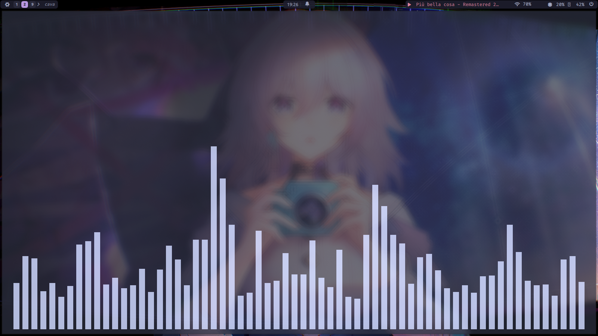

# ❄️ NixOS Hyprland Config

My personal NixOS setup: Hyprland + UWSM, Quickshell desktop shell,
Kitty + Catppuccin, Neovim (nixvim), SDDM astronaut,
AdGuard DNS with DoT/DNSSEC, Zen kernel.

## Screenshots




## Features

- Hyprland (UWSM session) + Hyprlock/Hypridle
- Quickshell panels, launcher, power menu, notifications
- Kitty (Catppuccin) · Neovim via nixvim · Fastfetch
- SDDM astronaut · GTK adw-gtk3-dark
- systemd-resolved (DNSSEC + DoT, AdGuard/Quad9)
- linux-zen · PipeWire · AppImage support

## Requirements

- NixOS x86_64, fresh install
- Git + a user with sudo

> Single host `nixos` (user `edu`). Machine values are hardcoded in
> `hosts/nixos/configuration.nix` (hostname, timezone/locale, DNS,
> `/mnt/Datos` mount, monitor, SDDM theme).

## Install

```bash
git clone https://github.com/Puasson/hyprland-nixos.git ~/nixos
cd ~/nixos
sudo nixos-generate-config --show-hardware-config > hosts/nixos/hardware-configuration.nix
```

- Without the data disk, drop the `fileSystems."/mnt/Datos"` block in
  `hosts/nixos/configuration.nix`.

```bash
nix flake check
sudo nixos-rebuild test --flake .#nixos
sudo nixos-rebuild switch --flake .#nixos
nix flake update && nix flake check
```

## Usage

- `nrt` = test · `nrs` = switch · `update` = `nix flake update`
  (aliases in `home/shell/bash.nix`).

## Notes

- `hosts/nixos/hardware-configuration.nix` is generated — regenerate, don't hand-edit.
- `system.stateVersion` / `home.stateVersion` are `26.05` — don't bump.
- `allowUnfree = true` required; Nix files use `nixfmt`.

## License

MIT © 2026 Puasson — see [LICENSE](LICENSE). Feel free to use and adapt.
